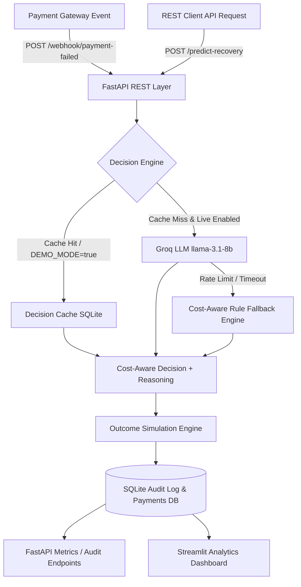

# 💳 AI-Powered Payment Recovery Agent (Enhanced Dunning Automation)

An enterprise-grade, cost-aware dunning microservice built with **Python 3.11**, **FastAPI**, **SQLite Audit Logging**, **Groq LLM (llama-3.1-8b-instant)**, and **Streamlit**.

Unlike standard dunning platforms that apply a single generic retry rule or focus solely on recovery percentage, this system optimizes for **NET Recovered Revenue** (Gross Recovered Revenue − Action Costs). It is delivered as a live, callable REST service with complete auditability, rate-limit resilience, and zero-setup demo support.

> ⚠️ **Portfolio Project Disclaimer**: Recovery outcomes in this demo are generated using a probabilistic simulation engine, not real transaction gateway data. This project showcases enterprise software architecture, cost-aware decisioning, and regulatory compliance patterns.

---

## 🎯 Problem Statement & Business Case

Failed payments represent **10-15% of subscription revenue loss** due to involuntary churn. Traditional dunning tools apply a single, uniform rule ("retry after 3 days") to every failed transaction. This approach fails to account for:

1. **Action Costs**: Escalating every fraud check to a human agent costs **$5.00** in specialist time. If the invoice is $15.00, manual review destroys net margin even if successful.
2. **Failure Characteristics**: A `network_timeout` for a loyal subscriber should be retried immediately for free (**$0.00**), whereas a `card_expired` error requires an automated update prompt (**$0.01**).
3. **Chronic Non-Payers**: Chasing low-LTV customers with repeated past failures wastes system resources; the optimal financial decision is to **deliberately write off (`do_not_pursue`)** the charge.

### The Objective Function
$$\text{Expected Net Value} = (\text{Amount Due} \times \text{Recovery Probability}) - \text{Action Cost}$$

---

## 🏗️ System Architecture



---

## 💰 Action Cost Model

| Action | Cost | Best Suited Scenario |
|---|---|---|
| `retry_immediately` | **$0.00** | Transient network timeouts for high-tenure, reliable customers |
| `retry_in_3_days` | **$0.00** | Standard automated retry for moderate-risk cases |
| `send_payment_update_email` | **$0.01** | Card expired errors on high-LTV accounts |
| `escalate_to_human_review` | **$5.00** | Fraud-flagged declines on high-value charges ($50+) where net value > cost |
| `do_not_pursue` | **$0.00** | Chronic failure, low-LTV customers (expected recovery < pursuit cost) |

---

## ⚡ FastAPI REST Endpoints

### 1. Predict Recovery Action
`POST /predict-recovery`
Recommends optimal recovery action and calculates expected net value.

**Request Payload:**
```json
{
  "customer_id": "CUST_0102",
  "customer_tenure_days": 340,
  "past_successful_payments": 14,
  "past_failed_payments": 1,
  "failure_reason": "card_expired",
  "amount_due": 149.99,
  "days_since_last_successful_payment": 22,
  "customer_ltv": 1250.00,
  "customer_segment": "loyal_high_value"
}
```

**Response:**
```json
{
  "customer_id": "CUST_0102",
  "recommended_action": "send_payment_update_email",
  "action_cost": 0.01,
  "estimated_recovery_probability": 0.58,
  "estimated_expected_net_value": 86.98,
  "reasoning": "Card expired for valuable customer ($1,250.00 LTV); sending payment update email ($0.01 cost) yields high net value of $86.98.",
  "decision_source": "cache"
}
```

### 2. Payment Gateway Webhook
`POST /webhook/payment-failed`
Simulates a Stripe/Razorpay webhook receiving a payment failure event, evaluating the decision, and logging to `audit_log`.

### 3. Customer Audit Trail
`GET /audit-log/{customer_id}`
Returns complete immutable decision audit trail for regulatory compliance.

### 4. Financial Summary Metrics
`GET /metrics/summary`
Returns comparison of Baseline vs Agent NET revenue, total action costs, and financial uplift.

---

## 🛡️ Rate-Limit Resilience & Zero-Setup Demo Mode

To ensure the demo never fails mid-walkthrough or when cloned by a recruiter:

1. **Pre-populated Decision Cache**: All synthetic rows are pre-computed into SQLite `decision_cache`.
2. **Default `DEMO_MODE=true`**: Serves predictions instantly from cache/fallback without requiring live LLM keys.
3. **Exponential Backoff**: Live calls retry twice (2s, 4s backoff) on transient errors.
4. **Graceful Rule Fallback**: Automatically degrades to a cost-aware heuristic engine on LLM rate-limit, returning `decision_source="rule_based_fallback"`.

---

## 📊 Key Results (100% Reproducible Seed=42)

| Metric | Naive Baseline | Cost-Aware AI Agent | Financial Uplift |
|---|---|---|---|
| **Recovery Rate** | **20.0%** (100/500) | **49.6%** (248/500) | **+29.6 pp** (+148.0% relative) |
| **Gross Recovered Revenue** | $18,025.80 | $39,833.16 | +$21,807.36 |
| **Action Costs Incurred** | $0.00 | $396.05 | +$396.05 |
| **NET Recovered Revenue** | **$18,025.80** | **$39,437.11** | **+$21,411.31 (+118.8% NET Gain)** |

### Failure Reason Breakdown
- **Card Expired** (111 payments): 22.5% baseline ➔ **72.1%** agent (**+$10,058.69 NET gain**) — *targeted email updates ($0.01 cost)*
- **Network Timeout** (114 payments): 41.2% baseline ➔ **68.4%** agent (**+$5,306.35 NET gain**) — *immediate retry ($0.00 cost)*
- **Fraud Check** (107 payments): 11.2% baseline ➔ **49.5%** agent (**+$4,158.30 NET gain**) — *selective human review ($5.00 cost)*
- **Insufficient Funds** (168 payments): 9.5% baseline ➔ **22.0%** agent (**+$1,887.97 NET gain**) — *3-day retry & 11 deliberate write-offs (`do_not_pursue`)*


---

## 🚀 Quick Start Guide

### 1. Setup & Seeding

```bash
# Clone & install dependencies
pip install -r requirements.txt

# Seed SQLite database, pre-compute decisions & audit logs
python run_demo.py
```

### 2. Launch FastAPI Microservice

```bash
uvicorn src.api:app --reload --port 8000
```
- Interactive API Docs: `http://localhost:8000/docs`
- Run API Test Suite: `python test_api.py`

### 3. Launch Streamlit Analytics Dashboard

```bash
python -m streamlit run app.py
```
- Dashboard URL: `http://localhost:8501`

---

## 📁 Repository Structure

```
Financial project/
├── app.py                      # Streamlit Analytics & Audit Trail Dashboard
├── run_demo.py                 # Pre-computed Demo Seeder Script
├── test_api.py                 # FastAPI Endpoint Verification Suite
├── requirements.txt
├── README.md
├── data/
│   └── payments.db             # SQLite DB (failed_payments, audit_log, decision_cache)
└── src/
    ├── __init__.py
    ├── api.py                  # FastAPI REST Microservice Layer
    ├── cost_model.py           # Action Costs & Expected Net Revenue Formulas
    ├── generate_data.py        # Synthetic Payment Event Generator ($ USD)
    ├── baseline.py             # Naive Recovery Baseline Simulation
    ├── agent.py                # Resilient Cost-Aware AI Agent Engine
    ├── audit.py                # Audit Logging Helpers
    ├── simulate_outcomes.py    # Outcome Simulation Engine
    └── compare_results.py      # Comparative Financial Analysis
```
