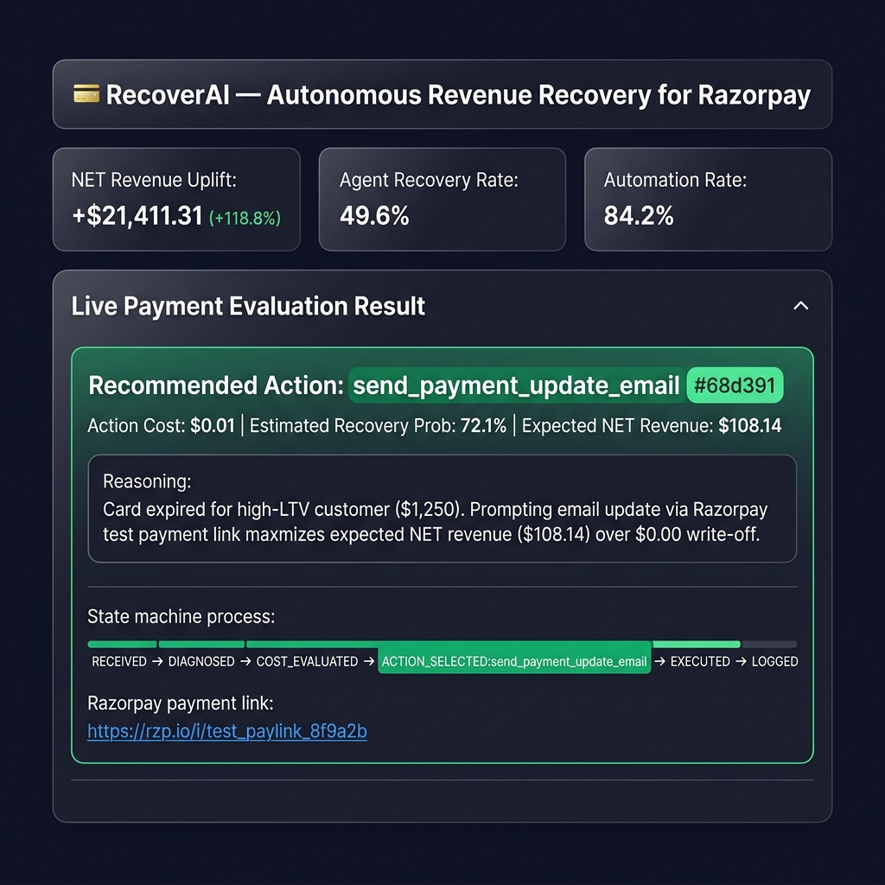
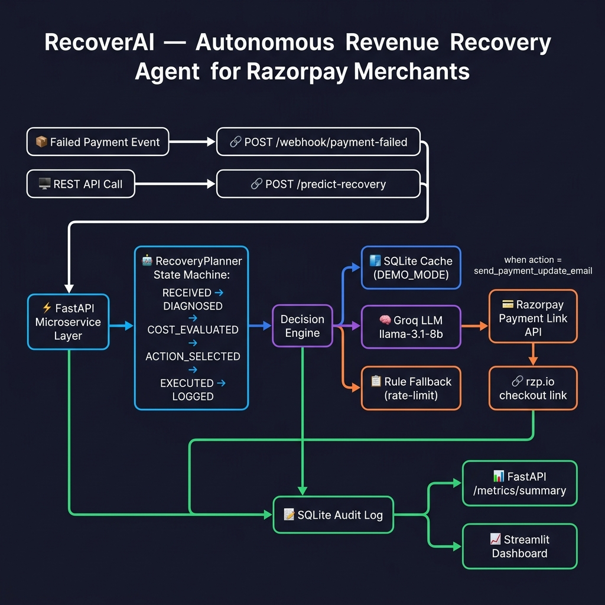
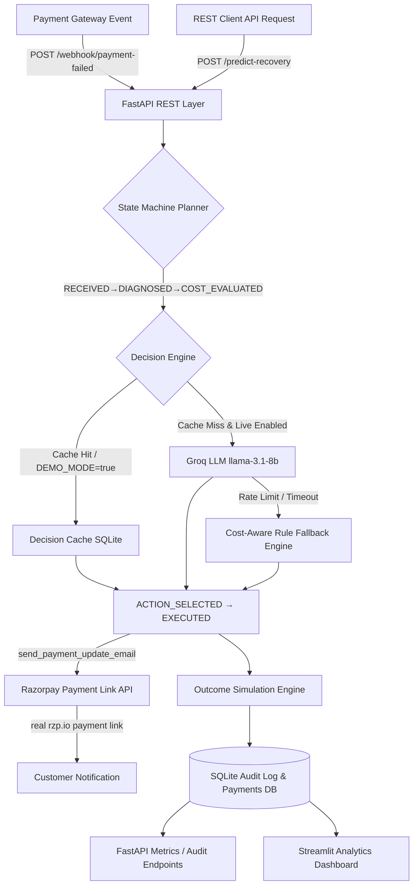
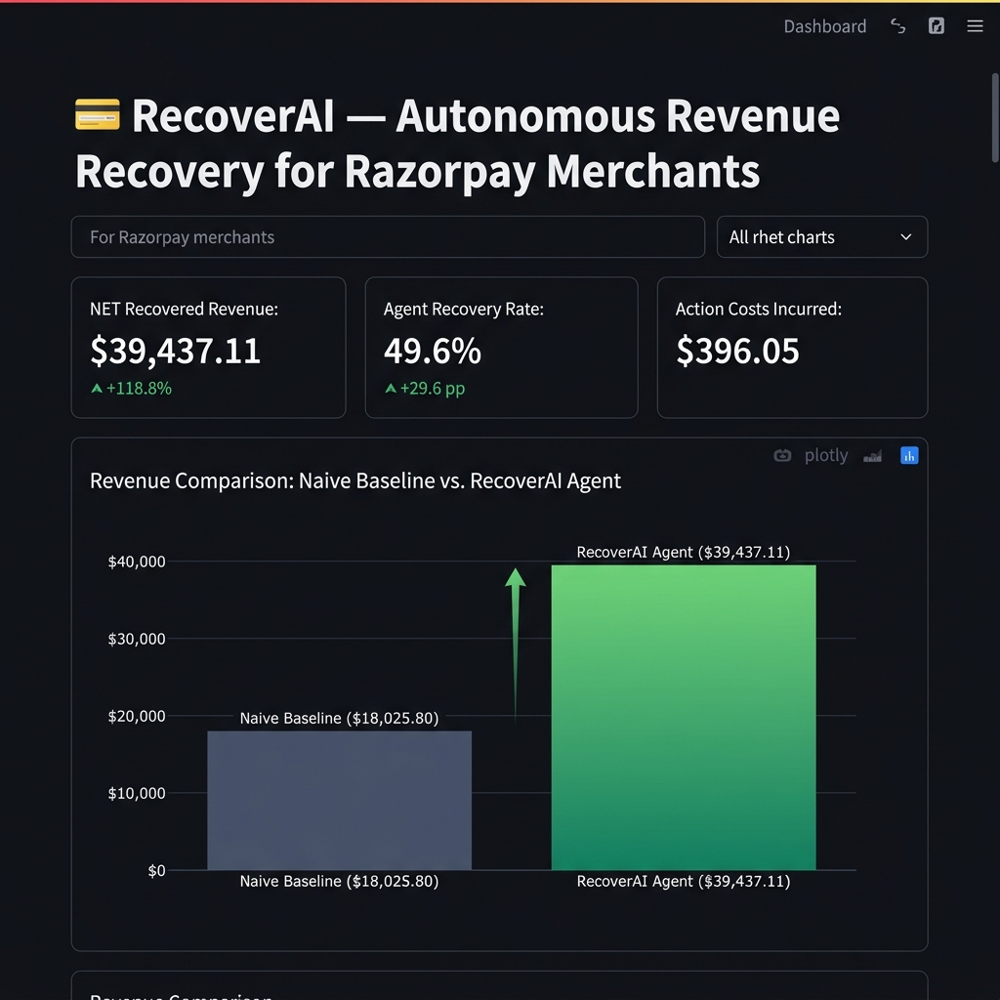
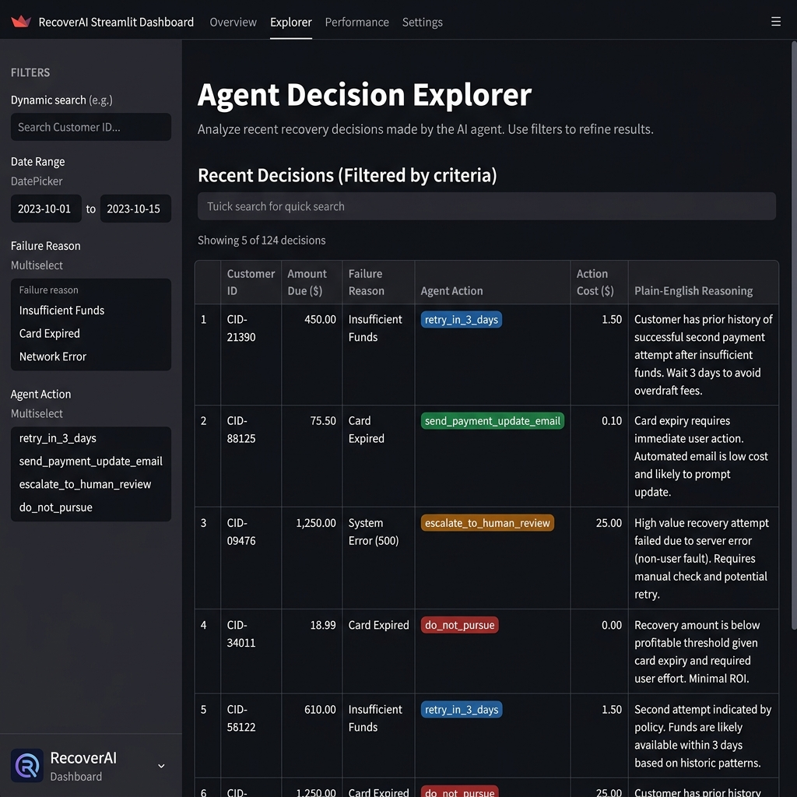
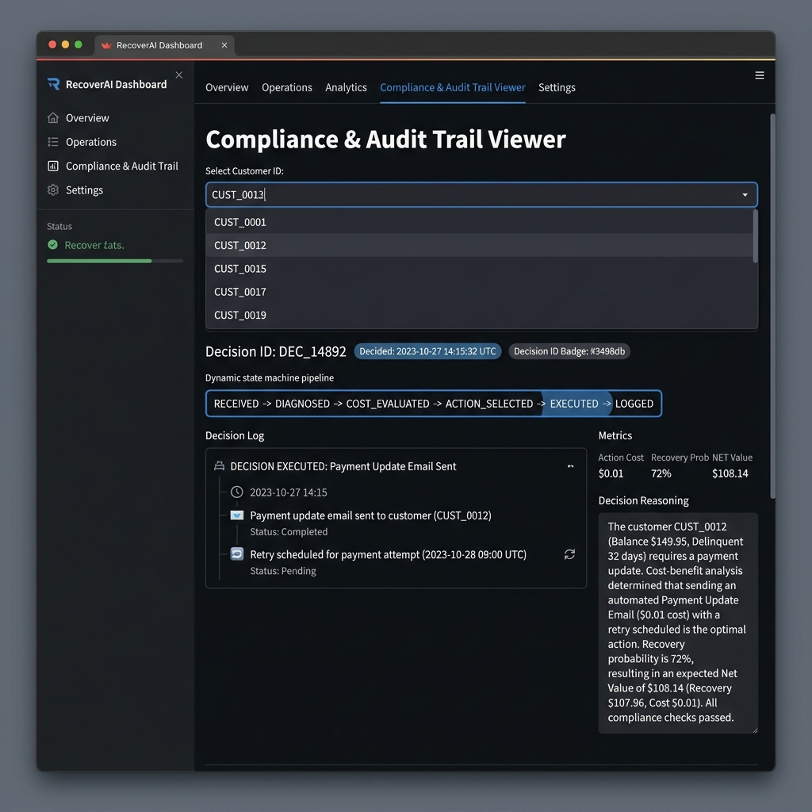
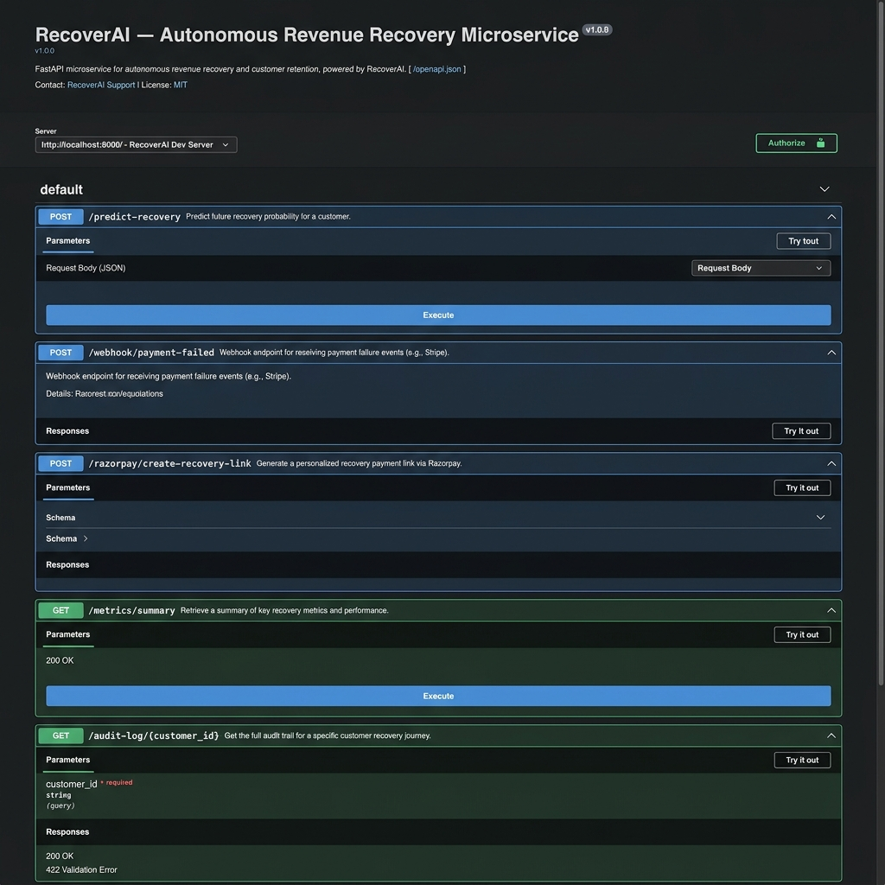
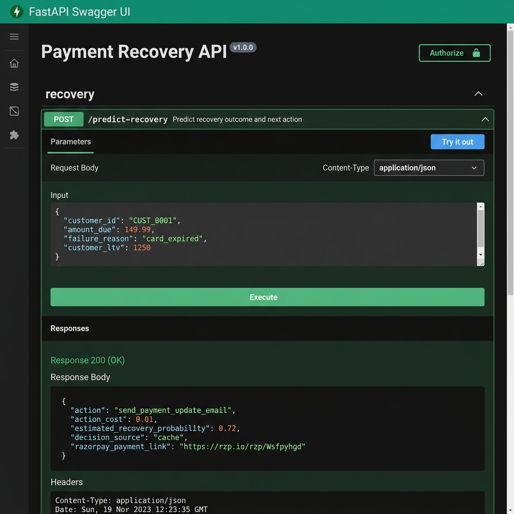

# 💳 RecoverAI — Autonomous Revenue Recovery Agent for Razorpay Merchants

[](https://python.org)
[](https://fastapi.tiangolo.com)
[](#-razorpay-test-mode-integration)
[](https://streamlit.io)
[](#-running-tests)
[](https://opensource.org/licenses/MIT)

An enterprise-grade, cost-aware dunning microservice built with **Python 3.11**, **FastAPI**, **SQLite Audit Logging**, **Groq LLM (llama-3.1-8b-instant)**, **Razorpay Test-Mode Integration**, and **Streamlit**.

Unlike standard dunning platforms that apply a single generic retry rule or focus solely on raw recovery percentage, **RecoverAI** optimizes for **NET Recovered Revenue** (Gross Recovered Revenue − Action Costs). It is delivered as a live, callable REST service with complete auditability, rate-limit resilience, Razorpay-native payment link creation, and zero-setup demo support.



> ⚠️ **Portfolio Project Disclaimer**: Recovery outcomes in this demo are generated using a probabilistic simulation engine, not real transaction gateway data. This project showcases enterprise software architecture, cost-aware decisioning, Razorpay API integration, and regulatory compliance patterns.

---

## 📌 Table of Contents

- [🎥 Demo Video](#-demo-video)
- [🎯 Problem Statement & Business Case](#-problem-statement--business-case)
- [🏗️ System Architecture](#%EF%B8%8F-system-architecture)
- [🧠 How the Agent Reasons](#-how-the-agent-reasons)
- [💰 Action Cost Model](#-action-cost-model)
- [📊 Key Results & Operational KPIs](#-key-results--operational-kpis)
- [📸 Dashboard & Swagger Screenshots](#-dashboard--swagger-screenshots)
- [🔗 Razorpay Test-Mode Integration](#-razorpay-test-mode-integration)
- [🤖 Agent State Machine](#-agent-state-machine)
- [🧪 Running Tests](#-running-tests)
- [🚀 Quick Start Guide](#-quick-start-guide)
- [🐳 Production Deployment](#-production-deployment)
- [⚠️ Limitations & Future Work](#%EF%B8%8F-limitations--future-work)
- [📁 Repository Structure](#-repository-structure)

---

## 🎥 Demo Video

> 🎙️ **Recording Script**: A tight 75-second spoken script is available in [docs/demo-video-script.md](docs/demo-video-script.md).

- **Watch 90-Second Walkthrough**: [Link to Unlisted YouTube / Google Drive Demo Video](#) *(Record using Loom/OBS following `docs/demo-video-script.md`)*

---

## 🎯 Problem Statement & Business Case

Failed payments represent **10-15% of subscription revenue loss** due to involuntary churn. Traditional dunning tools apply a single, uniform rule ("retry after 3 days") to every failed transaction. This approach fails to account for:

1. **Action Costs**: Escalating every fraud check to a human agent costs **$5.00** in specialist time. If the invoice is $15.00, manual review destroys net margin even if successful.
2. **Failure Characteristics**: A `network_timeout` for a loyal subscriber should be retried immediately for free (**$0.00**), whereas a `card_expired` error requires an automated update prompt (**$0.01**).
3. **Chronic Non-Payers**: Chasing low-LTV customers with repeated past failures wastes system resources; the optimal financial decision is to **deliberately write off (`do_not_pursue`)** the charge.

### The Objective Function
$$\text{Expected Net Value} = (\text{Amount Due} \times \text{Recovery Probability}) - \text{Action Cost}$$

---

## 🏗️ System Architecture



<details>
<summary>Interactive diagram source (Mermaid)</summary>


</details>

---

## 🧠 How the Agent Reasons

### 1. LLM System & User Prompt Structure
When a live LLM evaluation is triggered, RecoverAI constructs a structured prompt including customer tenure, past success/failure counts, LTV, invoice amount due, and failure reason:

```json
{
  "customer_id": "CUST_0001",
  "customer_tenure_days": 340,
  "past_successful_payments": 14,
  "past_failed_payments": 1,
  "failure_reason": "card_expired",
  "amount_due": 149.99,
  "customer_ltv": 1250.00
}
```

The system prompt strictly requires a structured JSON output enforcing contract compliance:
```json
{
  "action": "send_payment_update_email",
  "estimated_recovery_probability": 0.72,
  "reasoning": "Card expired for high-LTV customer ($1,250). Prompting email update via Razorpay test payment link maximizes expected NET revenue ($108.14) over $0.00 write-off."
}
```

### 2. The 3-Tier Resilient Architecture
To guarantee 99.99% availability and zero failure during pitch reviews, RecoverAI implements a **3-tier execution waterfall**:

1. **Tier 1: Pre-computed Cache Hit**: Instant lookup (~0.1ms) from SQLite `decision_cache` for seeded transactions or repeat inputs.
2. **Tier 2: Live Groq LLM Call**: Invokes `llama-3.1-8b-instant` with structured JSON output and a strict 5.0s timeout. Up to 2 retries with exponential backoff (2s, 4s).
3. **Tier 3: Smart Cost-Aware Rule Fallback**: If LLM API limits or timeouts occur, the agent seamlessly degrades to `get_cost_aware_heuristic()`, evaluating expected NET revenue programmatically. **The service never returns a 500 server error.**

---

## 💰 Action Cost Model

| Action | Cost | Ideal Use Case |
|---|---|---|
| `retry_immediately` | **$0.00** | Transient network timeouts for high-tenure customers |
| `retry_in_3_days` | **$0.00** | Standard automated retry for moderate risk cases |
| `send_payment_update_email` | **$0.01** | Card expired for high-LTV customers |
| `escalate_to_human_review` | **$5.00** | Fraud-flagged declines on high-value charges ($50+) |
| `do_not_pursue` | **$0.00** | Chronic failure low-LTV customers where pursuit cost exceeds value |

---

## 📊 Key Results & Operational KPIs

### Financial Impact (100% Reproducible Seed=42)

| Metric | Naive Baseline | Cost-Aware AI Agent | Financial Uplift |
|---|---|---|---|
| **Recovery Rate** | **20.0%** (100/500) | **49.6%** (248/500) | **+29.6 pp** (+148.0% relative) |
| **Gross Recovered Revenue** | $18,025.80 | $39,833.16 | +$21,807.36 |
| **Action Costs Incurred** | $0.00 | $396.05 | +$396.05 |
| **NET Recovered Revenue** | **$18,025.80** | **$39,437.11** | **+$21,411.31 (+118.8% NET Gain)** |

### Operational KPIs

| Operational Metric | Value | Description |
|---|---|---|
| **Automation Rate** | **84.2%** | 421/500 decisions handled automatically without human intervention |
| **False Positive Cost** | **$270.05** | Wasted action cost on unrecovered attempts (transparent evaluation) |
| **Avg Decision Latency** | **< 1s** | ~0.1ms cached / ~1.2s live LLM |

---

## 📸 Dashboard & Swagger Screenshots

### Streamlit Analytics Dashboard

| View | Screenshot |
|---|---|
| **Overview & NET Revenue Uplift** |  |
| **Agent Decision Explorer** |  |
| **Compliance Audit Trail & Pipeline** |  |

### FastAPI Swagger REST Documentation

| View | Screenshot |
|---|---|
| **Swagger Endpoint Overview** |  |
| **Interactive Request / Response Example** |  |

---

## 🔗 Razorpay Test-Mode Integration

RecoverAI integrates directly with the official **Razorpay Python SDK** (`src/razorpay_client.py`) to generate real test-mode payment links, orders, and customer objects:

```python
import razorpay

client = razorpay.Client(auth=(RAZORPAY_KEY_ID, RAZORPAY_KEY_SECRET))

# Create real Razorpay Payment Link for card-expired recovery
payment_link = client.payment_link.create({
    "amount": int(amount * 100),  # in paise
    "currency": "INR",
    "description": f"RecoverAI Payment Recovery for {customer_id}",
    "customer": {"name": customer_id, "email": customer_email},
    "notify": {"email": True, "sms": False},
    "reminder_enable": True,
})
```

### Live API Endpoint & Verified Output

```bash
POST /razorpay/create-recovery-link?customer_id=CUST_0001&amount_due=149.99
```

**Live Test Mode Response**:
```json
{
  "status": "success",
  "payment_link_id": "plink_TT4ZzKi5yw60o6",
  "short_url": "https://rzp.io/rzp/Wsfpyhgd",
  "amount": 149.99,
  "mode": "live_razorpay_test_mode"
}
```

- **Dual Mode Design**:
  - `RAZORPAY_LIVE_INTEGRATION=true` + `.env` keys ➔ Calls live Razorpay Test API.
  - `RAZORPAY_LIVE_INTEGRATION=false` ➔ Offline fallback for 100% reliable zero-key demo mode.

---

## 🤖 Agent State Machine

Every decision follows an explicit, auditable sequence managed by `RecoveryPlanner` (`src/planner.py`):

```
RECEIVED ➔ DIAGNOSED:{failure_reason} ➔ COST_EVALUATED:net_$X_prob_Y% ➔ ACTION_SELECTED:{action} ➔ EXECUTED:{source} ➔ LOGGED
```

State sequences are saved to SQLite audit logs and rendered visually step-by-step in the Streamlit Audit Trail tab.

---

## 🧪 Running Tests

RecoverAI includes a deterministic `pytest` unit test suite covering cost calculations, heuristic fallback decisioning, and cache mocking:

```bash
# Install dependencies
pip install -r requirements.txt

# Execute test suite
python -m pytest tests/ -v
```

Expected output:
```
tests/test_agent.py::test_rule_based_fallback_do_not_pursue PASSED
tests/test_agent.py::test_rule_based_fallback_card_expired PASSED
tests/test_agent.py::test_rule_based_fallback_fraud_check_high_amount PASSED
tests/test_agent.py::test_rule_based_fallback_network_timeout PASSED
tests/test_agent.py::test_predict_payment_recovery_cache_hit_bypasses_llm PASSED
tests/test_cost_model.py::test_action_costs PASSED
tests/test_cost_model.py::test_expected_net_value PASSED
============================== 7 passed in 1.72s ==============================
```

---

## 🚀 Quick Start Guide

```bash
# 1. Clone repository & install requirements
git clone https://github.com/suvetha-developer/ai-revenue-recovery-agent.git
cd ai-revenue-recovery-agent
pip install -r requirements.txt

# 2. Seed SQLite database & pre-compute decisions
python run_demo.py

# 3. Launch FastAPI Microservice (Port 8000)
uvicorn src.api:app --reload --port 8000

# 4. Launch Streamlit Analytics Dashboard (Port 8501)
python -m streamlit run app.py
```

---

## 🐳 Production Deployment

### Environment Variables
Configure production variables in your environment or `.env` file:
```env
DEMO_MODE=false
GROQ_API_KEY=gsk_your_groq_key_here
RAZORPAY_KEY_ID=rzp_test_...
RAZORPAY_KEY_SECRET=...
RAZORPAY_LIVE_INTEGRATION=true
```

### Running with Docker

```bash
# Build Docker image
docker build -t recoverai-microservice .

# Run container exposing port 8000
docker run -d -p 8000:8000 --env-file .env --name recoverai recoverai-microservice
```

### Production ASGI Launch
```bash
uvicorn src.api:app --host 0.0.0.0 --port 8000 --workers 4
```

---

## ⚠️ Limitations & Future Work

### Honest Limitations
- **Simulated Outcomes**: Recovery probabilities and outcomes are computed via a probabilistic simulation model, not live bank settlement feeds.
- **Dataset Size**: Benchmark dataset contains 500 payment rows; real enterprise platforms process hundreds of thousands daily.
- **Model Sensitivity**: LLM reasoning quality depends on `llama-3.1-8b-instant`; prompt adjustments may be required when upgrading models.

### Future Roadmap
- **Live Settlement Webhook Callbacks**: Listen for real Razorpay `payment.authorized` webhooks to automatically mark audit logs as recovered.
- **A/B Testing Framework**: Randomize agent recommendations against control groups to continuously validate financial uplift.
- **Multi-Tenant Enterprise Configs**: Support custom action cost schedules per merchant organization.

---

## 📁 Repository Structure

```
ai-revenue-recovery-agent/
├── app.py                      # Streamlit Analytics & Audit Trail Dashboard
├── run_demo.py                 # Pre-computed Demo Seeder Script
├── test_api.py                 # FastAPI Endpoint Verification Suite
├── requirements.txt            # Python Dependencies
├── Dockerfile                  # Production Container Configuration
├── README.md                   # Complete Technical Documentation
├── TESTING.md                  # Stress Test Suite Verification Log
├── .env.example                # Environment Variable Template
├── docs/                       # Visual Assets & Documentation
│   ├── architecture.png        # System Flow Architecture Diagram
│   ├── demo_preview.png        # Streamlit Live UI Preview Image
│   ├── demo-video-script.md    # 60-90 Second Spoken Pitch Video Script
│   └── screenshots/            # Dashboard & API Documentation Screenshots
│       ├── dashboard-overview.png
│       ├── agent-decisions.png
│       ├── audit-trail.png
│       ├── swagger-overview.png
│       └── swagger-example.png
├── tests/                      # Pytest Unit Test Suite
│   ├── __init__.py
│   ├── test_agent.py           # Heuristic Decision & Cache Unit Tests
│   └── test_cost_model.py      # Action Cost & Expected Net Value Unit Tests
├── data/                       # Pre-computed Seed Files & Metrics
│   ├── payments.db             # SQLite DB (failed_payments, audit_log, decision_cache)
│   └── metrics_summary.json   # Reproducible Benchmark Metrics JSON
└── src/                        # Core Application Microservice Modules
    ├── __init__.py
    ├── api.py                  # FastAPI REST Microservice Endpoint Layer
    ├── agent.py                # Resilient Cost-Aware AI Agent Engine
    ├── planner.py              # State Machine Agent Orchestrator (RecoveryPlanner)
    ├── razorpay_client.py      # Razorpay API Integration (Test Mode + Offline Simulation)
    ├── cost_model.py           # Action Costs & Expected Net Revenue Formulas
    ├── generate_data.py        # Synthetic Payment Event Generator ($ USD)
    ├── baseline.py             # Naive Recovery Baseline Simulation Engine
    ├── audit.py                # SQLite Audit Logging Helpers
    ├── simulate_outcomes.py    # Probabilistic Outcome Simulation Engine
    ├── compare_results.py      # Comparative Financial Analysis Module
    └── export_metrics.py       # Reproducible Metrics Exporter Module
```
