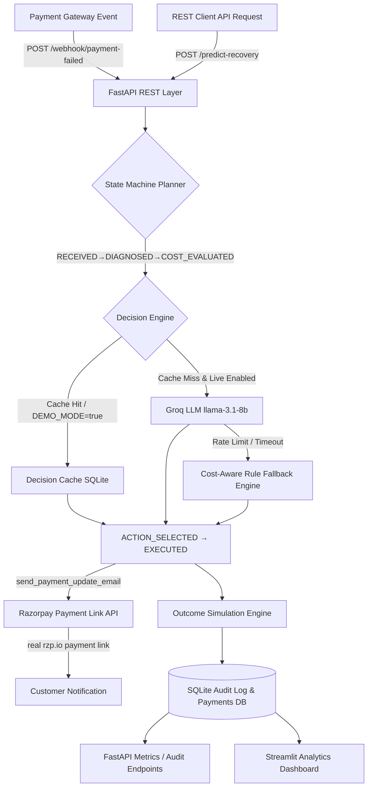

# 💳 RecoverAI — Autonomous Revenue Recovery Agent for Razorpay Merchants

An enterprise-grade, cost-aware dunning microservice built with **Python 3.11**, **FastAPI**, **SQLite Audit Logging**, **Groq LLM (llama-3.1-8b-instant)**, **Razorpay Test-Mode Integration**, and **Streamlit**.

Unlike standard dunning platforms that apply a single generic retry rule or focus solely on recovery percentage, this system optimizes for **NET Recovered Revenue** (Gross Recovered Revenue − Action Costs). It is delivered as a live, callable REST service with complete auditability, rate-limit resilience, Razorpay-native payment link creation, and zero-setup demo support.


> ⚠️ **Portfolio Project Disclaimer**: Recovery outcomes in this demo are generated using a probabilistic simulation engine, not real transaction gateway data. This project showcases enterprise software architecture, cost-aware decisioning, Razorpay API integration, and regulatory compliance patterns.


---

## 🎯 Problem Statement & Business Case

Failed payments represent **10-15% of subscription revenue loss** due to involuntary churn. Traditional dunning tools apply a single, uniform rule ("retry after 3 days") to every failed transaction. This approach fails to account for:

1. **Action Costs**: Escalating every fraud check to a human agent costs **$5.00** in specialist time. If the invoice is $15.00, manual review destroys net margin even if successful.
2. **Failure Characteristics**: A `network_timeout` for a loyal subscriber should be retried immediately for free (**$0.00**), whereas a `card_expired` error requires an automated update prompt (**$0.01**).
3. **Chronic Non-Payers**: Chasing low-LTV customers with repeated past failures wastes system resources; the optimal financial decision is to **deliberately write off (`do_not_pursue`)** the charge.

### The Objective Function
$$\text{Expected Net Value} = (\text{Amount Due} \times \text{Recovery Probability}) - \text{Action Cost}$$

---

## 🏗️ System Architecture



---

## 💰 Action Cost Model

| Action | Cost | Ideal Use Case |
|---|---|---|
| `retry_immediately` | **$0.00** | Transient network timeouts for high-tenure customers |
| `retry_in_3_days` | **$0.00** | Standard automated retry for moderate risk cases |
| `send_payment_update_email` | **$0.01** | Card expired for high-LTV customers |
| `escalate_to_human_review` | **$5.00** | Fraud-flagged declines on high-value charges ($50+) |
| `do_not_pursue` | **$0.00** | Chronic failure low-LTV customers where pursuit cost exceeds value |

---

## 🔗 Razorpay Test-Mode Integration

The system integrates with the **real Razorpay API** in test mode via `src/razorpay_client.py`:

| Feature | Description |
|---|---|
| **Payment Links** | `create_payment_link(amount, customer_id)` — Creates a real Razorpay-hosted checkout link for card-expired recovery |
| **Orders API** | `create_order(amount, receipt_id)` — Creates a test-mode order representing the recovery transaction |
| **Fetch Payment** | `fetch_payment_details(payment_id)` — Retrieves status & error codes from Razorpay |
| **New Endpoint** | `POST /razorpay/create-recovery-link` — Returns a live `rzp.io/...` payment link |

**Integration Modes:**
- `RAZORPAY_LIVE_INTEGRATION=false` (default): Runs fully offline — returns realistic simulated Razorpay objects. **Zero API keys required.**
- `RAZORPAY_LIVE_INTEGRATION=true`: Calls real Razorpay Test Mode API. Requires `RAZORPAY_KEY_ID` and `RAZORPAY_KEY_SECRET` from [Razorpay Dashboard → API Keys](https://dashboard.razorpay.com/app/keys).

> **Design rationale**: Core decisioning runs fully offline for reliability. The live Razorpay integration is available and demonstrated on demand — toggle `RAZORPAY_LIVE_INTEGRATION=true` with your own test keys to see real payment links generated.

---

## 🤖 Agent State Machine (RecoveryPlanner)

Every decision flows through explicit, auditable state transitions (in `src/planner.py`):

```
RECEIVED → DIAGNOSED:{failure_reason} → COST_EVALUATED:net_$X_prob_Y% → ACTION_SELECTED:{action} → EXECUTED:{source} → LOGGED
```

The state sequence is stored in every audit log entry and rendered visually in the **Audit Trail Viewer** tab of the Streamlit dashboard.

---

## 🛡️ Demo Reliability & Resilience Design

To ensure the demo never fails mid-walkthrough or when cloned by a reviewer:

1. **Pre-populated Decision Cache**: All synthetic rows are pre-computed into SQLite `decision_cache`.
2. **Default `DEMO_MODE=true`**: Serves predictions instantly from cache/fallback without requiring live LLM keys.
3. **Exponential Backoff**: Live calls retry twice (2s, 4s backoff) on transient errors.
4. **Graceful Rule Fallback**: Automatically degrades to a cost-aware heuristic engine on LLM rate-limit, returning `decision_source="rule_based_fallback"`.
5. **Razorpay Offline Simulation**: Simulated Razorpay objects (`rzp_test_...`, `https://rzp.io/i/test_...`) returned when `RAZORPAY_LIVE_INTEGRATION=false`.

---

## 📊 Key Results (100% Reproducible Seed=42)

| Metric | Naive Baseline | Cost-Aware AI Agent | Financial Uplift |
|---|---|---|---|
| **Recovery Rate** | **20.0%** (100/500) | **49.6%** (248/500) | **+29.6 pp** (+148.0% relative) |
| **Gross Recovered Revenue** | $18,025.80 | $39,833.16 | +$21,807.36 |
| **Action Costs Incurred** | $0.00 | $396.05 | +$396.05 |
| **NET Recovered Revenue** | **$18,025.80** | **$39,437.11** | **+$21,411.31 (+118.8% NET Gain)** |

### Failure Reason Breakdown
- **Card Expired** (111 payments): 22.5% baseline ➔ **72.1%** agent (**+$10,058.69 NET gain**) — *targeted email updates ($0.01 cost)*
- **Network Timeout** (114 payments): 41.2% baseline ➔ **68.4%** agent (**+$5,306.35 NET gain**) — *immediate retry ($0.00 cost)*
- **Fraud Check** (107 payments): 11.2% baseline ➔ **49.5%** agent (**+$4,158.30 NET gain**) — *selective human review ($5.00 cost)*
- **Insufficient Funds** (168 payments): 9.5% baseline ➔ **22.0%** agent (**+$1,887.97 NET gain**) — *3-day retry & 11 deliberate write-offs (`do_not_pursue`)*

---

## 📈 Operational KPIs

| KPI | Value | Description |
|---|---|---|
| **Automation Rate** | **84.2%** | Decisions handled without human review (421/500 payments auto-resolved) |
| **False Positive Cost** | **$270.05** | Wasted action cost on unrecovered attempts (transparent honest evaluation) |
| **Avg Decision Latency** | **< 1s** | Cached: ~0.1ms per event · Live LLM: ~1.2s per event |

---

## 🚀 Quick Start Guide

### 1. Setup & Seeding

```bash
# Clone & install dependencies
pip install -r requirements.txt

# Seed SQLite database, pre-compute decisions & audit logs
python run_demo.py
```

### 2. Launch FastAPI Microservice

```bash
uvicorn src.api:app --reload --port 8000
```
- Interactive API Docs: `http://localhost:8000/docs`
- Run API Test Suite: `python test_api.py`

### 3. Launch Streamlit Analytics Dashboard

```bash
python -m streamlit run app.py
```
- Dashboard URL: `http://localhost:8501`

### 4. (Optional) Enable Live Razorpay Integration

```bash
# 1. Copy .env.example to .env
cp .env.example .env

# 2. Add your Razorpay test-mode keys (from dashboard.razorpay.com/app/keys)
# RAZORPAY_KEY_ID=rzp_test_...
# RAZORPAY_KEY_SECRET=...
# RAZORPAY_LIVE_INTEGRATION=true

# 3. Call the recovery link endpoint
curl -X POST "http://localhost:8000/razorpay/create-recovery-link?customer_id=CUST_0001&amount_due=149.99"
```

---

## 📁 Repository Structure

```
Financial project/
├── app.py                      # Streamlit Analytics & Audit Trail Dashboard
├── run_demo.py                 # Pre-computed Demo Seeder Script
├── test_api.py                 # FastAPI Endpoint Verification Suite
├── requirements.txt
├── README.md
├── TESTING.md                  # Failure-mode stress test documentation
├── .env.example                # Configuration template (no real keys)
├── data/
│   ├── payments.db             # SQLite DB (failed_payments, audit_log, decision_cache)
│   └── metrics_summary.json   # Reproducible metrics (seed=42)
└── src/
    ├── __init__.py
    ├── api.py                  # FastAPI REST Microservice Layer
    ├── agent.py                # Resilient Cost-Aware AI Agent Engine
    ├── planner.py              # State Machine Agent Orchestrator (RecoveryPlanner)
    ├── razorpay_client.py      # Razorpay API Integration (Test Mode + Offline Simulation)
    ├── cost_model.py           # Action Costs & Expected Net Revenue Formulas
    ├── generate_data.py        # Synthetic Payment Event Generator ($ USD)
    ├── baseline.py             # Naive Recovery Baseline Simulation
    ├── audit.py                # Audit Logging Helpers
    ├── simulate_outcomes.py    # Outcome Simulation Engine
    ├── compare_results.py      # Comparative Financial Analysis
    └── export_metrics.py       # Reproducible Metrics JSON Exporter
```
